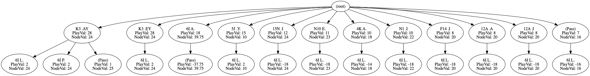

# How does Macondo work?

[Back to Main Page](/macondo)

- [Monte Carlo](#monte-carlo)
- [Endgame](#endgame)
- [Move Generator](#move-generator)
- [Leaves](#leaves)
- [Why Go](#why-go)

## Monte Carlo

Macondo is a child of the Brian Sheppard / Maven method for Crossword games. Essentially, we believe that doing a truncated lookahead will result in a better ranking of Crossword game positions than score + leave alone (equity) can. However, these equity values are important for ranking the plays in the lookahead algorithm and picking the best one.

The lookahead algorithm is named the "Truncated Monte Carlo tree search". It is truncated because it only looks ahead two plies by default, as opposed to going to the end of the game. It is called Monte Carlo because that's a city in Monaco known for its casinos and randomness, and during the Manhattan Project some scientists realized that although their computers were not powerful enough to simulate all the ins and outs of a nuclear bomb, they could pick random parameter values, and with enough of these, a result that is "good enough" would ensue. So they called this the Monte Carlo method and bought out all the books of random digits out there. Yes, really, you can purchase books containing nothing but randomly generated digits.

So, Macondo generates all possible moves for a position, and sorts them by equity. It then takes the first few of those moves (maybe 15 or so) and does a 2-ply lookahead by default for each play, by picking random racks for the opponent response, and then a random draw to the original play, from what's in the tile pool. This is one iteration. After a few hundred iterations, values begin to converge and the top performing move is usually pretty good.

The equity of each move is calculated as:

Points + Spread Difference + Leftover Difference

- Points is the score of the move
- Spread difference is the spread difference in the game after N plies
- Leftover difference is the difference between the equities of the "leftover" tiles after N plies.

### Example:

Your opening rack is `AEINQST`. You score 22 for `8G QI`. Your opponent responds with `H8 (I)NTIFADA` for 98 pts; their leftover leave is empty. You drew `UU` to your beautiful leave of `AENST` so Macondo picks `(Q)UA` for 18 pts, keeping `ENSTU`, your leftover leave.

The equity of this iteration is:

    Points: 22 +

    Spread difference: 22 - 98 + 18 = -58 +

    Equity of ENSTU (12.6 at this time, but will change) minus Equity of empty leave (0) = 12.6

    = -23.4

Obviously, your opponent will not respond with INTIFADA that often, and you will not draw UU often either, so over time, the equity value of this play should be largely positive, the more iterations you do. You'll notice values starting to converge after just a few hundred iterations.

## Endgame

The endgame engine does _not_ use the B\* algorithm that the Maven author suggested. The main reason is that I can't understand exactly how to use it, and the paper was quite sparse on details of its implementation. However, the paper suggested that "full-width alpha-beta searching" was the standard way to do this, and although computers of the time were too slow to handle it, computers nowadays can handle many complex endgames with this exhaustive method (not all).

We made a compromise between accuracy and speed. I believe B\* also does this to some extent.

### How it works:

We generate all possible endgame moves, and then a number of possible responses (30 or so) sorted by score, and recursively iterate down the tree, exhaustively checking every combination. We use alpha-beta pruning and a decent heuristic function for ranking plays while searching the tree. Basically, plays that cause opponents to get stuck will rank higher, as well as plays that block high-scoring moves.

We use minimax to figure out the play that leads to the best endgame sequence; this assumes optimal play on both sides.

Iterative deepening is also used to allow the algorithm to stop in a decent amount of time. Basically, the algorithm looks 1 ply ahead, then 2 plies, then 3, etc. This means that at any time, it can be stopped (usually because of time constraints) and the play it has found can be deemed to be "good enough". It very often will be the right play, depending on the game.

If the endgame is a complex one where both players have to one-tile, and they have many options, then it will take a very long time to solve exhaustively. However, many times 3 or 4 plies will still finish very rapidly, and the answer will be close to correct.

In the future we intend to re-explore B\* and see if there's a way we can make it work within our endgame framework.

The picture below shows an example of a simple endgame and some generated nodes, after 2 plies of depth. As the tree grows in breadth and depth, the image becomes too rapidly horizontal and hard to see.

## Move Generator

The move generator uses the GADDAG data structure, proposed in a 90s paper titled "A Faster Scrabble Move Generation Algorithm", by Steven Gordon.

It's pretty damn fast. However, for the purposes of simulation and solving exhaustive endgames, I think we could still see at least an order of magnitude improvement if we chose a better algorithm. I believe there are algorithms out there that can generate moves way faster than GADDAGs; they may be more memory inefficient, but nowadays that's not much of an issue with most modern computers.

If anyone smart out there can think of a fast movegen algorithm I'm all ears.

## Leaves

Jesse generated a set of exhaustive leaves for this app; the details are found in the `/notebooks` directory of the source. They were generated by having the app play itself a few million times, using new values, and repeating a few times.

These need to be tweaked a bit. Basically, good values are not good enough and bad values are not bad enough, especially for longer leaves. We will continue to research this. We may need to have it play itself 100M or more times.

The leaves are looked up in a Minimal Perfect Hash for speed, instead of a map structure.

# Why Go

Why go home, why go home?

We used the Go language because we wanted a language that was fast and not C++, which is not at all fun to work with. Particularly, goroutines and contexts in Go make it easy to do multithreading and control the lifetimes of complex calculations; for example we can easily stop sims or an endgame that is going out of control.

Additionally, Go has great support for the protobuf API we intend to build. The API can be used to interface with this app and allow it to run sims and other aspects of games remotely, hopefully through a nice web-based UI in the future.

Go is a pretty un-fancy language that is easy to learn. It can be a bit verbose, but it's easy to read and the language itself is pretty small. The standard library rocks. At the time that I started writing in Go, it was barely in the top 100 most popular languages. Nowadays it's about to break the top 10. It's a great language.

However, the garbage collector can be slow, and aspects of Go make it a bit easy to be lazy and allocate lots of memory. We've tried to not do that in this code but there are certainly some memory-hungry parts of it. For the large majority of purposes, Go works perfectly fine, but I predict that when we start really trying to generate huge amounts of data for machine learning, the memory management and relative slowness (compared to languages like C) might come to bite us.

If I (César) could go back in time, I would maybe choose Rust for this. Rust is also a clean, safe, and extremely fast language. It has a bigger learning curve, but I love the memory management and its great support for WASM, which I think we'll need in the future for embedding Macondo into the web browser. Rewriting everything in Rust will take way too long, though.
